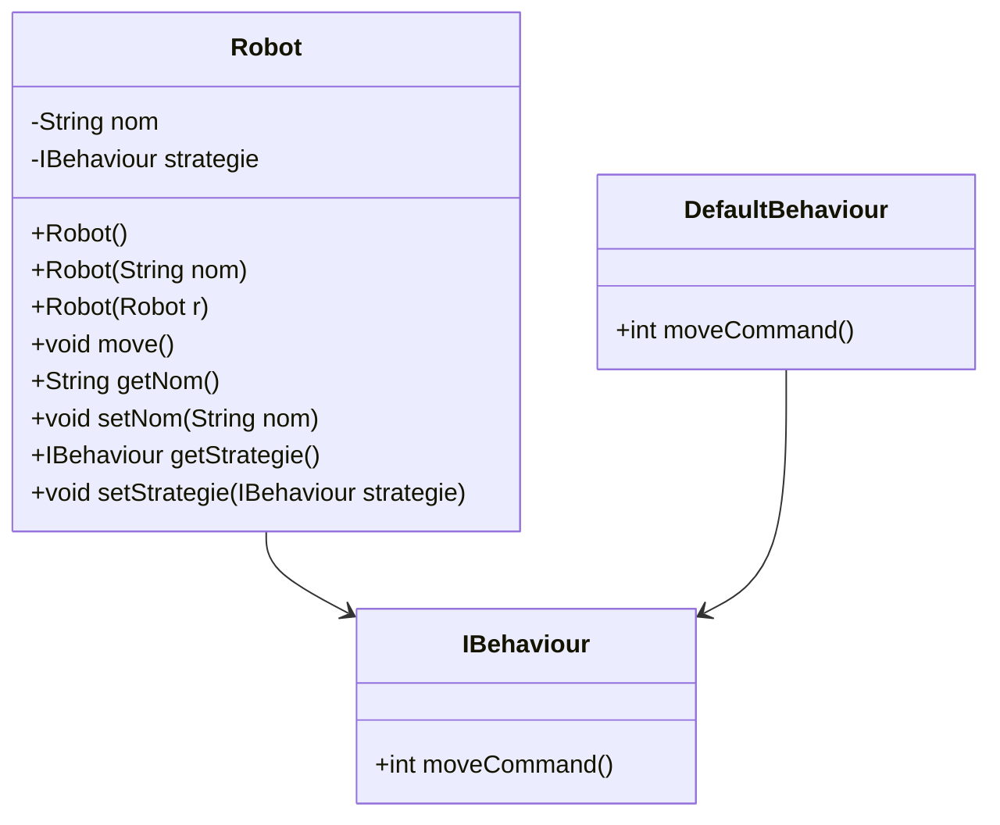

# Projet Robot

## Vue d'ensemble

Ce projet représente un robot avec un nom et une stratégie de déplacement. Le robot peut être initialisé avec un nom et une stratégie par défaut ou avec une stratégie spécifique.

## Structure du projet

